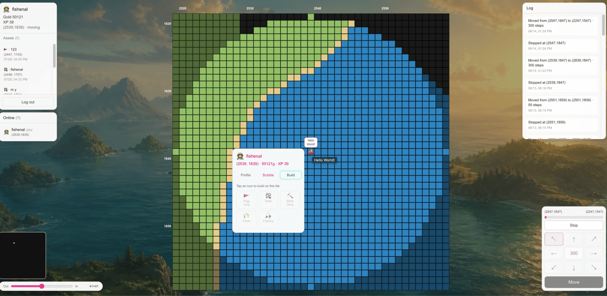

# Gridhorizon

**Welcome to a vast and lonely world.**

Gridhorizon is an asynchronous open-world exploration game on a procedural **8000×8000** map. You travel tile by tile (even while offline), lift fog of war, build, and occasionally meet other travelers in the same lonely expanse.

It is built as a playable prototype and an open collaboration: Next.js (App Router), Neon Postgres + Drizzle, Auth.js, and Ably for realtime presence / map sync. The live site is deployed on [Vercel](https://vercel.com).

- **Play:** [gridhorizon.vercel.app](https://gridhorizon.vercel.app/)
- **Contact:** [yu_dong_han@hotmail.com](mailto:yu_dong_han@hotmail.com)

## Screenshots



## Contributing

We welcome PRs. Typical flow:

1. Fork (or get write access) and create a **feature branch** from `preview`  
   (e.g. `feat/…`, `fix/…`).
2. Develop and test locally.
3. Open a **pull request into `preview`**. Keep the PR focused; describe what changed and how to try it.

The maintainer periodically merges `preview` into `main` for production releases. Please do **not** open PRs directly against `main` unless asked.

Please email [yu_dong_han@hotmail.com](mailto:yu_dong_han@hotmail.com) for design discussion, pairing, and secrets (see below) before large refactors.

### Shared secrets (database & Ably)

`.env.example` lists required variables, but **we do not publish a live `DATABASE_URL` or `ABLY_API_KEY` in the repo.** Contributors usually get credentials one of two ways:

1. **Email the maintainer** at [yu_dong_han@hotmail.com](mailto:yu_dong_han@hotmail.com) for a shared development `DATABASE_URL`, Ably key, and other setup details (preferred if you want to hit the same world as others).
2. **Provision your own free stack** and put the URLs in `.env.local`:
   - **Postgres:** create a free [Neon](https://neon.tech) project and copy the connection string into `DATABASE_URL`.  
     This app uses Neon’s serverless HTTP driver (`@neondatabase/serverless`), so a plain Docker Postgres URL will **not** work without changing the DB client.
   - **Ably:** create a free [Ably](https://ably.com) app and set `ABLY_API_KEY` (server-only; never expose it to the browser).
   - **Auth:** set `AUTH_SECRET` yourself (`openssl rand -base64 32`).

After `DATABASE_URL` is set, run `pnpm db:push` once to apply the schema.

## Local development

Requires Node.js 20+ and [pnpm](https://pnpm.io).

```bash
pnpm install
cp .env.example .env.local
```

Fill at least:

| Variable | Purpose |
|----------|---------|
| `DATABASE_URL` | Neon Postgres URL (see [Contributing](#contributing)) |
| `AUTH_SECRET` | Auth.js secret (`openssl rand -base64 32`) |
| `ABLY_API_KEY` | Ably app key (realtime presence / map sync) |

Optional: `TRAVEL_SECONDS_PER_TILE` (default `1`), `WORLD_SEED` (default `424242`), `CRON_SECRET` (production cron only).

Then:

```bash
pnpm db:push
pnpm dev
```

Open http://localhost:3000. New visitors see **Login** / **Just try**; **Just try** creates a device-local traveler. Returning guests on the same browser restore automatically. Use the gear next to your name in-game to set a lasting username/password, avatar, and bubble.

Settlement primarily happens on read; local/dev works without Cron. In production, Vercel Cron hits `/api/cron/tick` daily at UTC 00:00 as a server-wide fallback.

## Gameplay summary

### World & vision

- Shared procedural map **8000×8000**, seeded by `WORLD_SEED` (same seed → same terrain). Terrain is generated from seed (not stored in the DB).
- Fog of war: you only see tiles you have explored. Vision radius is **20**.
- New travelers spawn near the map center with **200** gold and **20** food.

#### Terrain types & mix

Approximate share of the full map (noise-based; varies slightly by seed):

| Terrain | Role | Approx. share |
|---------|------|----------------|
| **Water** | Ocean (low elevation) + inland lakes | **~32–38%** of map |
| **Land** (below) | Everything else | **~62–68%** of map |

Of **land** tiles (generator targets):

| Terrain | Notes | Approx. share of land |
|---------|-------|------------------------|
| **Grass** | Default plains | **~42%** |
| **Forest** | Moister inland; wood nodes more common | **~28%** |
| **Desert** | Arid inland + beach / lakeside sand | **~18%** |
| **Mountain** | High elevation; ore / stone nodes | **~12%** |

Resource nodes on land (sparse overlays): **ore** / **stone** on mountains, **wood** on forest (and rarely grass), **stone** on desert. Mines on a resource tile convert that resource into gold during economy cycles.

### Travel

- Click to pathfind and move asynchronously. Progress settles by elapsed time when you come back—even offline.
- Speed is `TRAVEL_SECONDS_PER_TILE` seconds per tile (code default **1**; raise it for slower “live” feel; production often uses a much higher value).
- Each tile traveled grants **+1 gold** and **+1 XP**.
- Crossing another player’s flag/town influence can charge a **toll** (payer and owner both gain participation XP).

### Building & economy

Stand on an empty tile to build. The only occupancy rule is **that tile has no building yet** (yours or anyone else’s). Resources are granted **immediately on build** (no timed production).

- **Flag** 🪙100: any tile, including water. Names the flag; influence / toll zone.
- **Quarry** 🪙500: any land tile. Instantly grants 🪨10.
- **Farm** 🪙500: any land tile. Instantly grants 🍞10.
- **Lumber camp** 🪙500: any land tile. Instantly grants 🪵10.
- **Town** 🪙500 🪨10 🪵10 🍞10: any land tile. Instantly grants 👥10. (One quarry + farm + lumber camp supplies one town.)

🪙 gold comes from travel. 👥 population is the endgame score. Placing a structure also grants ✨ XP.

### Social

- Meeting another player inside your vision auto-adds them as a friend.
- Resource trades and land offers are available between players.
- Online presence and nearby map updates use Ably when configured.

### Account

- **Just try** = guest on this device (token in `localStorage`).
- Gear → **Login** tab: set username/password to keep the same traveler across devices.
- Gear → **Style**: avatar emoji and bubble message shown to others.

## License

[MIT](./LICENSE) © 2026 fishenal
